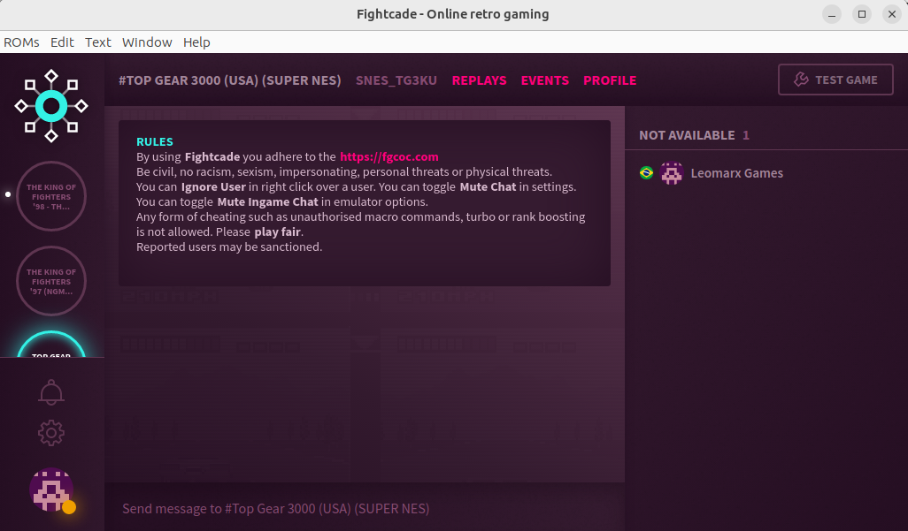

# **A Comunidade Top Gear Championships (TGC) Apresenta:** #

# **Campeonato Top Gear 3023 - O futuro é agora!!!** #

# **LEIA TODAS AS REGRAS COM BASTANTE ATENÇÃO!!!** #

# **Inscrições:** #

CONFIRME SUA INSCRIÇÃO UTILIZANDO O MODELO ABAIXO:

    Apelido/Nickname: LeomarxGames
    Número de telefone com WhatsApp: +55 11 99349-9981
    Disponibilidade para jogar: à noite durante a semana e finais de semana a combinar com antecedência
    Método: Fightcade 2 (fc2)
    Declaração: Declaro que estou ciente das regras aqui estabelecidas e serei automaticamente desclassificado em caso de descumprimento: ( X ) SIM ( ) NÃO. A inscrição só será efetivada caso o participante marque a opção SIM.

As inscrições para o torneio podem ser encerradas antecipadamente, caso seja atingido o número par de participantes para que o chaveamento seja feito de forma correta com um número par de jogadores 8/10/12/14/16... 32.

Poderá ser feito cadastro reserva de jogadores a fim de preencher possíveis desistência de jogadores.

A TGC se reserva ao direito do uso de imagem dos participantes deste torneio, seja para retransmissões de partidas realizadas, bem como na divulgação de vídeos promocionais em suas redes sociais (Facebook, Instagram, TikTok, etc)

# **Validação e Verificação de perfil dos Inscritos:** #

A administração da TGC, na intenção de criar um campeonato com credibilidade, se reserva no direito de solicitar a qualquer momento  durante a inscrição e/ou durante o campeonato informações adicionais a qualquer um dos inscritos em seus campeonatos.
Tais medidas vem com o intuito de impedir a inscrição ou participação de jogadores fakes.

As informações solicitadas servem para um processo de verificação/confirmação de identidade, tais como:
- Perfil de rede social com foto (Facebook/Instagram/WhatsApp/Discord/Telegram/Twitter/TikTok/Outras).
- Vídeo chamadas por qualquer uma das redes sociais mencionadas que o participante tenha conta.
- Detalhes técnicos e verificação do processo de conexão online compartilhando a tela. (TeamViewer/AnyDesk/Outros)
- Tipo de computador, Fotos do modem, Empresa de internet, IP virtual, IP do roteador, VPN, etc.

O jogador inscrito tem o **direito de não fornecer as informações solicitadas**, assim como a TGC, também se reserva o **direito de não confirmar a inscrição ou remover um participante durante um campeonato**, que não concorde em providênciar as informações que lhe forem solicitadas.

# **Cronograma (Previsão):**
Prazo para confirmações e novas inscrições: 15/07/2023 às 11h59

Após revisão das inscrições será feito o sorteio das pistas/países e inicia-se a Fase de Grupos

Fase de grupos terá prazo de 13 dias. Previsão de término – 28/07/2023 23h59

Oitavas de final terá prazo de 6 dias: 29 a 03/08/2023 23h59

Quartas de final terá prazo de 6 dias: 04 a 10/08/03 23h59

Semifinal, Final e terceiro terá prazo de 7 dias: 11 a 17/08/2023 23h59

**Observação:** As rodadas podem ter um prazo estendido caso a administração julgue necessário. *Queremos ver quem é o melhor na pista e não um show de regras com W.O's*

# **Organização e Chaveamento:**

Será utilizado o CHALLONGE para chaveamento das partidas do campeonato.

Modelo copa do mundo. (Chaveamento, Oitavas, quartas, semis, final e terceiro).

O nível do jogo será o CHAMPIONSHIP (MODO VERSUS).

Fase de grupos: Partidas de 4 pistas, todos contra todos da chave. Vence a melhor soma dos pontos das 4 primeiras pistas

Oitavas, Quartas de Final e Semifinal: Partidas de 7 pistas (full game), vence a melhor soma dos pontos.

Final e terceiro: Partidas de 14 pistas (2 x full game), não podendo repetir o mesmo carro, vence a melhor soma dos pontos.

# **Pontuação:**

1st = 10 pontos
2nd = 6 pontos
3rd = 3 pontos
4th = 0 pontos

# **Como Jogar ?**

1 - Para jogar o campeonato basta agendar com o seu oponente pelo grupo de whatsApp que será criado o melhor horário para ambos;
2 - Entrarem na sala da disputa do FightCade 2 **"(Top Gear 3000 (USA) (SUPER NES)"**
3 - Ao carregar o jogo selecionar 4 Players (2 jogadores humanos e 2 jogadores BOT).
4 - Selecionar o carro desejado. Carro livre. Conforme lista a seguir:
5 - Vence aquele que somar a pontuação ao final da disputa.

**TG3K_Carro_A_Cheetah**

**TG3K_Carro_B_The_Demon**

**TG3K_Carro_C_The_Phantom**

**TG3K_Carro_D_The_Pegasus**

**TG3K_Sala_FIghtCade**

# **Classificação Desempate:**

A classificação da fase de grupos se dará pela Pontuação Geral.

Na fase de grupos o desempate se aplicará apenas na Pontuação geral, seguindo as regras:

- Pontuação Geral, Confronto Direto, Jogos Vencidos, Pontos Conquistados.

Nas fases finais haverá um número ímpar de pistas, mas se ainda ocorrer, o desempate segue o exemplo abaixo:
        
Inicia-se um novo full game versus(7 pistas):
    - Proibido repetir o carro que já jogou.
    - Vence o desempate, o jogador que abrir mais de 5 (cinco) pontos em qualquer momento da disputa.
    - Permanecendo uma diferença menor ou igual a 5 pontos após mais um full game versus (7 pistas), o jogo deverá ser reiniciado jogado sucessivamente, sem repetir os carros, até que um jogador abra mais de 5 pontos de vantagem.

# **Comunicação:**
Serão criados grupos no aplicativo WhatsApp para cada um dos grupos de pilotos, sendo este o canal oficial para as marcações das partidas e divulgação de resultados.

A permanência no grupo é obrigatória e o jogador que não participar estará eliminado do campeonato. 

O grupo deve ser usado para os anúncios da administração, agendamento de partidas e assuntos relevantes ao campeonato, tais como informações de problemas com conexão, remarcação de partidas, encaminhamentos de links das lives e postagem de resultados.

Os jogadores podem mencionar seu oponente, marcando com @, para agendamento de sua partida. Essa menção deverá acontecer no máximo a cada 24h. Após a terceira menção do oponente (72h), sem a devida resposta, o jogador poderá reivindicar o W.O à administração.

Os participantes que não realizarem suas partidas ou agendamento delas nos prazos aqui estabelecidos, através do grupo oficial do campeonato, receberão W.O.:

O envio de mensagens no chat do emulador estará proibido caso um dos participantes solicite no início da partida. 

A gravação da partida é opcional, porém caso haja discordância do resultado postado sem uma gravação o resultado postado de comum acordo entre os pilotos será o válido. Se não houver comum acordo, joguem novamente.

Exemplo de postagem:

- Grupo A - Rodada 4
- @Player1 36 x 28 @Player2

**Mensagens sem Relevância**:

- O jogador que enviar mensagens no grupo, sem relevância para o campeonato, serão advertidos pela administração. Em caso de reincidência, o jogador será REMOVIDO do grupo. Mesmo com a punição, o jogador tem o dever de cumprir os seus jogos previamente agendados; 
- Após 8h, o jogador removido poderá solicitar aos administradores entrar novamente ao grupo. O jogador readmitido no grupo que, após a segunda advertência, tiver que receber a segunda punição, estará eliminado do campeonato.

# **Regras de Conduta:**
Sobre o teor das mensagens trocadas entre os participantes: 

Mensagens de zoeira e gozação são permitidas, desde que não sejam ofensivas segundo as regras. É passível de desclassificação do campeonato mensagens ofensivas que se enquadrem em pelo menos um dos tipos de discriminação abaixo, dirigidos ao jogador ou à sua família:

- Racial ou étnica;
- Gênero ou Religião;
- Status social;
- De idade;
- Deficiência;
- Difamação ou calúnia;
- Nacionalidade, Naturalidade ou Lugar onde mora, ou nasceu.

**Denúncia:**

Denúncias e reclamações por ofensas somente serão consideradas e julgadas pela administração, se ocorrerem nos CANAIS OFICIAIS DA TGC (Facebook, WhatsApp do campeonato, Discord, YouTube, Twitch, Instagram e outros) ou no chat da transmissão oficial de uma partida válida do campeonato. 
Chats privados e quaisquer outros meios não serão considerados.
Após análise, se caracterizada a ofensa desrespeitosa com a dignidade da pessoa, a administração se reserva à punição única de exclusão do campeonato e proibição de inscrição no campeonato seguinte.
Outras medidas referentes a processos legais, deverão ser adotadas pelo próprio requerente, sem o envolvimento da administração da TGC
As capturas de tela das mensagens ou áudios devem ser encaminhados por meio de protocolo conforme modelo a seguir, pelo Facebook com a hashtag #PROTOCOLO e que deverá ser respondido pela administração em um prazo máximo de 48h úteis.

**Modelo de protocolo:**

PROTOCOLO DE JULGAMENTO DE CONDUTA:
- NOME DO CAMPEONATO:
- NOME DO SOLICITANTE:
- NOME DO OPONENTE:
*SOLICITAÇÃO: Solicito que os administradores da TGC julguem se a conduta a seguir é caracterizada como discriminação conforme previsto no item de Regras de Conduto e seus subitens.*
*ACUSAÇÃO: descrever a alegação de forma sucinta.*
*ANEXOS: encaminhar as imagens, vídeos e áudios que julgar relevante no tópico aberto ou no privado dos administradores*

# **Regras Gerais:**

Clique aqui para ler as Regras Gerais <https://www.facebook.com/groups/topgearchampionships/permalink/3391700757764527>.

Bugs e Trapaças estão proibidos, punições estão descritas no link acima. Cabendo ainda uma punição maior após análise da TGC.

Caso alguma Regra Geral esteja divergente de alguma regra estabelecida aqui neste post, vale a regra deste documento para o campeonato.

# **Regras Específicas:**

- Será utilizado o emulador Fightcade 2 - **"(Top Gear 3000 (USA) (SUPER NES)"** ;
- A escolha de câmbio (automático ou manual) é livre durante todo o campeonato;
- A conexão deverá ser estabelecida pela plataforma;
- Em comum acordo, os jogadores podem trocar de controle quanto forem iniciar o desempate e/ou jogo de volta para corrigir o grid de largada corretamente; 
  - Não havendo consenso na escolha de quem é o Player 1 ou o Player 2, o Player 1 será aquele que vier primeiro na tabela do Challonge;
- O resultado da partida será a soma dos pontos obtidos pelos jogadores em cada país disputado;
- Procedimento para início da partida:
  - Selecione 4 Jogadores;
    - Digitem seus nomes se desejado;
    - Selecionem o Carro;
#
**Situações inéditas podem ocorrer e os casos não previstos aqui serão analisados pela administração no decorrer do campeonato.**

**As regras podem ser aditadas durante o campeonato caso a administração julgue necessário para cobrir casos que não eram cobertos por essas regras buscando não prejudicar os participantes.**

# **A administração da TGC deseja a todos os participantes um excelente campeonato!!!**
