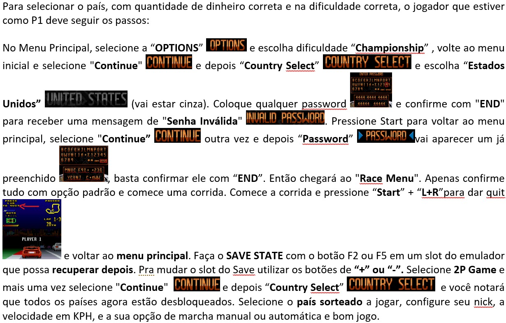
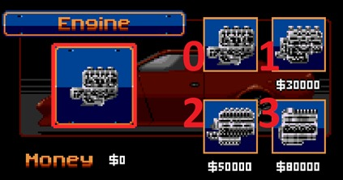

# **O canal Leomarx Games e a Comunidade Top Gear Championships (TGC) Apresentam:** #

# **5° Campeonato Mestres do Top Gear 2 - 2024** #

# **LEIA TODAS AS REGRAS COM BASTANTE ATENÇÃO!!!** #

# **1 - Incrições:** #

1.1 - O novo modelo de inscrições de campeonatos da TGC terá sempre uma pré-lista de inscritos já validados e ativos conforme os participantes dos campeonatos recentes.

1.2 - Aqueles pré-inscritos que não tiverem a disponibilidade de jogar poderão sair do grupo do WhatsApp criado a qualquer momento durante o período de inscrições.

1.3	- Novos participantes deverão se inscrever através de postagem realizada diretamente nos comentários do post correspondente no Facebook.

CONFIRME SUA INSCRIÇÃO UTILIZANDO O MODELO ABAIXO:

    Exemplo:
    Apelido/Nickname: LeomarxGames
    Disponibilidade para jogar: Descrever o melhor possível. Ex.: Disponibilidade das 19 as 23h30 durante a semana e finais de semana a combinar com antecedência.
    Confirmo que instalei os items obrigatórios listados no regra n°3 para participar (Null DC Bear + Radmin e/ou Hamachi e Fightcade 2)
    Declaração: Declaro que estou ciente das regras e dos itens obrigatórios aqui estabelecidos e poderei ser eliminado do campeonato em caso de descumprimento: ( X ) SIM (   ) NÃO. (a inscrição só será efetivada caso o participante marque a opção SIM)

1.4 - Logo de seguida deverá ingressar no grupo de WhatsApp do Campeonato pelo [Link](https://chat.whatsapp.com/BFBflL6e0fMF2nSm1EYnkT) e se apresentar com o seu Nome Real + Apelido/NickName

# **2 - Validação e Verificação de Perfil dos Inscritos:** #

2.1 - A administração da TGC, na intenção de criar um campeonato com credibilidade, se reserva no direito de solicitar a qualquer momento durante a inscrição e/ou durante o campeonato, informações adicionais a qualquer um dos inscritos em seus campeonatos.

2.2 - Tais medidas, vem com o intuito de impedir a inscrição ou participação de jogadores com contas fakes.

2.3 - As informações solicitadas servem para um processo de verificação/confirmação de identidade, tais como:

- Perfil de rede social com foto (Facebook/Instagram/WhatsApp/Discord/Telegram/Twitter/TikTok/Outras).
- Vídeo chamadas por qualquer uma das redes sociais mencionadas que o participante tenha conta.
- Detalhes técnicos e verificação do processo de conexão online (Hamachi/Radmin), compartilhando a tela. (TeamViewer/AnyDesk/Outros)
- Tipo de computador, fotos do modem, Empresa de internet, IP virtual, IP do roteador, VPN, etc.

2.4 - O jogador inscrito tem o **direito de não fornecer as informações solicitadas**, assim como a Leomarx Games e/ou TGC, também se reservam ao **direito de cancelar a inscrição ou remover um participante durante um campeonato**, que não concorde em providenciar as informações que lhe forem solicitadas.

# **3 - Itens Obrigatórios:** #

3.1 - **Emulador Null DC 1.96c =** Link para download [aqui](https://github.com/RossenX/NullDC-BEAR/releases/tag/1.96c)

3.2 - **Emulador FightCade 2 =** Link para download [aqui](https://www.fightcade.com/)

3.3 - **ROM Top Gear 2 (USA) =** Link para download [aqui](https://wowroms.com/pt/roms/super-nintendo/top-gear-2-usa/29935.html)

3.4. - **Radmin para conexão entre os jogadores** = Link para download [aqui](https://www.radmin-vpn.com/)

3.5. - **Hamachi para conexão entre os jogadores** = Link para download [aqui](https://vpn.net/)

# **4 - Cronograma (Previsão):** #

4.1 - As inscrições serão aceitas de 09/06/2024 até às 20h00 do dia 12/06/2024;

4.2 - Após confirmação das inscrições, será realizado o sorteio dos países e a Fase de Grupos terá prazo de até 14 dias;

4.3 - Prazos previstos ( Todos em Horário de Brasília até as 23h do último dia ):

- Fase de grupos terá prazo de 14 dias. 
- Oitavas de final terá prazo de 5 dias.
- Quartas de final terá prazo de 5 dias.
- Semifinal terá prazo de 5 dias.
- Final e terceiro terá prazo de 5 dias.

4.4 - **Observação:** As rodadas podem ter o prazo estendido ou reduzido, caso a administração julgue necessário. *Queremos ver quem é o melhor na pista e não um show de regras com aplicação de W.O's*

4.5 - Durante a fase de grupos, na primeira metade do prazo (até dia 19/06/2024 23h59), cada piloto deverá ter realizado ao menos metade das partidas (arredondando para baixo). 

4.6 - O competidor que não cumprir o item 4.5, poderá ser desclassificado e receber W.O de todas as partidas não realizadas aleatóriamente

# **5 - Organização e Chaveamento:** #

5.1 - Será utilizado o CHALLONGE para chaveamento das partidas do campeonato [https://challonge.com/pt_BR/4_MestresDoTopGear2_2024](https://challonge.com/pt_BR/5_MestresDoTopGear2_2024)

5.2 - O nível do jogo será o CHAMPIONSHIP.

5.3 - O campeonato terá modelo de copa do mundo com fase de grupos e os melhores colocados avançam para uma fase final de jogos mata-mata.

5.4 - Sorteio de Países. Serão sorteados 2 paises para cada rodada na fase de grupos, não se repetindo nenhum deles nas oitavas de final e quartas de final. A partir da Semifinal serão considerados todos os países novamente, sendo a quantidade:

- Fase de grupos: 2 países, sendo 1 país para 1 rodada (Como se fosse jogos de ida e volta).
- Oitavas e Quartas de Final: 3 países de rodada única (Vence quem tiver mais pontos na soma total)
- Semifinal, Final e terceiro: 4 países de rodada única (Vence quem tiver mais pontos na soma total)

5.5 - Serão classificados para a fase final uma quantidade de jogadores, dependendo da quantidade de inscritos. Exemplo:

- Inscritos: até 08. Classificados: 6;
- Inscritos: entre 09 e 12. Classificados: 8;
- Inscritos: entre 13 e 16. Classificados: 10;
- Inscritos: entre 17 e 20. Classificados: 12;
- Inscritos: entre 21 e 24. Classificados: 16;
- Inscritos: entre 25 e 28. Classificados: 20;
- Inscritos: entre 29 e 32. Classificados: 24;
- O número de grupos e de participantes por grupo será definido após encerramento das inscrições.

# **6. Classificação e Desempate:**

6.1 - Os jogadores pontuarão de acordo com seu resultado em cada partida de acordo com a relação a seguir:

- Vitória = 3 pontos;
- Empate = 1 ponto;
- Derrota = 0 pontos.

6.2 - Os critérios de desempate na fase de grupo serão:

- Confronto Direto;
- Jogos Vencidos;
- Pontos Conquistados;
- Diferença de Pontos.

6.3 - Em caso de empate nas fases finais reinicia-se a ROM e joga-se a partir do país sorteado para desempate:

- No desempate os pilotos devem utilizar normalmente a regra de dinheiro e upgrades.
- Vencerá aquele que ao final do país tiver mais pontos que o oponente;
- Permanecendo o empate no primeiro país, *reinicia-se a ROM e joga-se o país seguinte ao anterior* e assim sucessivamente, até haver um vencedor;
- Se durante o desempate houver Race Over para ambos, vencerá o piloto que **terminar na frente, em qualquer posição, mesmo com Race Over** (ver mais detalhes nesta seção).
- Obs.: Em comum acordo, os jogadores podem trocar de controle quanto forem iniciar o desempate para corrigir o grid de largada corretamente. Caso não haja consenso, será o player 1, aquele que tiver terminado na frente na última pista anterior ao início do desempate.

6.4 - A substituição de jogadores só será adimitida, caso o piloto substituto ainda possa participar refazer todas as partidas da fase de grupos antes do final do prazo. Se não houver substituto, será aplicado **w.o. apenas para as partidas restantes**, com pontuação máxima para o adversário e mínima para o desistente.

6.5 - Depois de 50% da partida realizada, o piloto pode avisar ao oponenete que deseja parar e admitir a derrota. Assim, o adversário leva os 5 pontos de cada pista restante e o desistente fica com zero pontos nas mesmas. Para este caso, a partida não será considerada um w.o e não haverão sansões.

# **7 - Validação das partidas:** #

7.1 - É obrigatório gravar as partidas, seja pelo OBS Studio ou Emulador. Se for possível para um dos participantes, o ideal será transmiti-las ao vivo.

7.2 - Ambos os jogadores são responsáveis pela gravação. Sugere-se que se um for fazer a transmissão que o outro grave para em caso de travamento da live a partida seja validada.

7.3 - Os jogadores que não gravarem ou transmitirem suas partidas, **terão seus confrontos invalidados** e não poderão abrir PROTOCOLO de possíveis irregularidades cometidas pelo adversário.

7.4 - A resolução ideal é em HD 1280x720 (720p), porém para aqueles que não tenham um computador que consiga nesta gravar ou transmitir nessa resolução, a resolução mínima aceita será (SD) 854 x 480 (480p).

7.5 - O arquivo de gravação deve ser disponibilizado na nuvem e o link divulgado no grupo do WhatsApp, ou também pode ser feito o envio de arquivo de gravação diretamente no WhatsApp.

7.6 - Não serão aceitos resultados enviados sem o cumprimento das regras de gravação mencionadas, sendo que uma nova partida deve ser realizada ou a renúncia de derrota por W.O. por um dos participantes.

7.7 - Se a partida ocorrer pela plataforma do FightCade 2 (FC2). Ela gera um link após a partida que pode ser usado como registro de gravação da partida.

# **8 - Comunicação:**

8.1 - Serão criados grupos no WhatsApp para cada um dos grupos sorteados, sendo este o canal oficial para as marcações das partidas e divulgação de resultados. A Administração enviará como mensagens fixadas a lista com os nomes e contatos dos participantes em cada grupo ( ou grupo único ) para facilitar o contato entre os pilotos
 
8.2 - A permanência no grupo é obrigatória e o jogador que não participar estará eliminado do campeonato. O grupo deve ser usado para os anúncios da administração, agendamento de partidas e dúvidas e assuntos relevantes ao campeonato, tais como informações de problemas com conexão, remarcação de partidas, encaminhamentos de links das lives e postagem de resultados.

8.3 - Os jogadores podem mencionar seu oponente, marcando com @, para agendamento de sua partida. Essa menção poderá ser realizada quantas vezes o jogador quiser, mas para efeitos de regras de verificação para W.O., só será considerada uma menção a cada 24 horas. Após a terceira menção do oponente (72h), sem a devida resposta, o jogador poderá reivindicar o W.O à administração.

8.4 - Os participantes que não realizarem suas partidas ou agendamento delas nos prazos estabelecidos, através do grupo oficial do campeonato, receberão W.O., podendo ser substituído por jogador que estiver em cadastro de reserva ou atribuída derrota pelo placar de pontuação máxima para o adversário e mínima para quem for aplicado o W.O.

8.5 - O W.O. será atribuído a favor daquele que oferecer maior tempo de disponibilidade, ou contra aquele que não comparecer no horário previamente agendado.

8.6 - O envio de mensagens no chat do emulador estará proibido caso um dos participantes solicite no início da partida.

8.7 - **É obrigatório gravar as partidas, seja pelo OBS ou Emulador, ou transmiti-las ao vivo. Jogadores que não gravarem ou transmitir suas partidas, terão seu confronto invalidado e não poderão abrir PROTOCOLO de possíveis irregularidades cometidas pelo adversário.**

8.8 - Os resultados das partidas devem ser informados no grupo respectivo do WhatsApp que o jogador for adicionado.

8.9 - Os participantes poderão agendar o início de suas partidas para no máximo até 2h (duas horas) antes do encerramento do prazo estabelecido.

8.10 - O lançamento dos resultados deverá ser realizado até às 23h do último dia do prazo, sendo a tolerância para o lançamento de até 15 min (quinze minutos).

Exemplo de postagem de resultado:

- **Grupo A - Rodada 4**
- **@Player1 110 x 100 @Player2**
- **Link da live ou link do arquivo da gravação.**

8.11 - **Mensagens sem Relevância**: O jogador que enviar mensagens sem relevância para grupo WhatsApp do campeonato, serão advertidos pela administração. Em caso de reincidência, o jogador será REMOVIDO do grupo por 12h e adicionado novamente após esse prazo. Mesmo com a punição, o jogador tem o dever de cumprir os seus jogos previamente agendados. O jogador readmitido no grupo será eliminado do campeonato caso receba mais uma punição por descumprimento do grupo de WhatsApp.

# **9 - Regras de Conduta** #

9.1 - É passível de eliminação do campeonato, mensagens ofensivas que se enquadrem em pelo menos um dos tipos de discriminação abaixo, dirigidos ao jogador ou à sua família:

- Racial ou étnica;
- Gênero ou Religião;
- Status social;
- De idade;
- Deficiência;
- Difamação ou calúnia;
- Nacionalidade, Naturalidade, ou Lugar onde mora, ou nasceu.

9.2 - OBSERVAÇÕES: Mensagens trocadas em redes sociais particulares não serão consideradas. Denúncias e reclamações por ofensas somente serão consideradas e julgadas pela administração, se ocorrerem nos CANAIS OFICIAIS DA TGC (Facebook, WhatsApp, Discord, YouTube, Twitch, Instagram e outros) ou no chat da transmissão oficial de uma partida válida do campeonato. Chats privados (PV) e quaisquer outros meios não serão considerados. Caracterizada a ofensa desrespeitosa com a dignidade da pessoa, a administração se reserva exclusivamente à punição de exclusão do campeonato.

9.3 - Outras medidas referentes a processos legais, deverão ser adotadas pelo próprio requerente. 

9.4 - Para protocolar a reclamação, os print’s das mensagens ou áudios (enviados no período de realização do campeonato, nas redes oficiais da TGC), devem ser encaminhados através de protocolo conforme modelo no item a seguir, pelo Facebook, no post de inscrição do campeonato com a hashtag #PROTOCOLO e deverá ser respondido pela administração em um prazo máximo de 48h úteis.

9.5 - **Modelo de protocolo:**

    PROTOCOLO DE JULGAMENTO DE CONDUTA NOME DO CAMPEONATO:
    - NOME DO CAMPEONATO:
    - NOME DO SOLICITANTE:
    - NOME DO OPONENTE:
    *SOLICITAÇÃO: Solicito que os administradores da TGC julguem se a conduta a seguir é caracterizada como discriminação conforme previsto no item de Regras de Conduto e seus subitens.*
    *ACUSAÇÃO: descrever a alegação de forma sucinta.*
    *ANEXOS: encaminhar as imagens, vídeos e áudios que julgar relevante no tópico aberto ou no privado dos administradores*

# **10 - Premiação de Troféus do Campeonato** #

10.1 - A inscrição e a participação no campeonato é gratuita.

10.2 - A confecção de troféus de acrílicos tem o custo de r$ 100 e após o encerramento das inscrições a Leomarx Games fará enquete no grupo de participantes sobre a opinião de divisão de custos entre todos de forma **integral**.

10.3 - Para melhorar o custo de envio dos troféus que tiverem que ser enviados para o exterior (México, Peru ou Venezuela, por exemplo). Será feito um estudo se o melhor custo não seria o troféu ser confeccionado de forma local.

10.3 - Aprovando a divisão de custos, o 1°, 2° e 3° lugar receverão ao final do torneio troféus de acrílico com o reconhecimento. (modelo em elaboração). 

10.4 - O participante que receber o troféu ou aceitar dividir os custos devem seguir/curtir/inscrever-se em todas as redes sociais da Leomarx Games e mencionar o canal e todas as redes abaixo nas suas postagens de lives das partidas:

Link das Redes:

<https://www.facebook.com/groups/mestresdotopgear2>

<https://youtube.com/@LeomarxGames>

<https://www.facebook.com/LeomarxGames>

<https://www.instagram.com/leomarxgames>

<https://twitter.com/LeomarxGames>

<https://www.twitch.tv/leomarxgames>

<https://www.tiktok.com/@leomarxgames>

**10.4 - Entrega da Premiação:** Após o campeonato, os vencedores devem indicar um nome/nick com até 15 caracteres para a confecção do troféu personalizado com seu nome, e quando estiver pronto o participante ganhador **deve arcar com os custos de frete do troféu** saindo de São Paulo, Brasil para o seu endereço. (Simular frete saindo do CEP 03510-000). Dúvidas entre em contato pelo WhatsApp no PV ou no grupo do campeonato.

# **11 - Regras das Corridas: Leia com bastante atenção**

11.1 - Após o encerramento das inscrições a Leomarx Games fará enquete no grupo de participantes do WhatsApp, sobre a opinião de um campeonato no modelo **VALE TUDO (Dirty Edition)** A depender do resultado da votação poderemos seguir ou ignorar alguns regras listadas abaixo. Sendo que as regras a partir deste ponto seguir servirão como base e poderão ser alteradas, mas em caso de divergência **caberá ao ADM a decisão final**.

11.2 - Feita a votação em 12/06/2024 o resultado final, a maioria dos pilotos votaram pelo campeonato no modelo *F1* (Modelo que é proibido fechadas). Então as regras tenha atenção as regras relacionadas a este item descritas abaixo. Apesar da fechada estar proibida, a coleta e uso do dinheiro e a coleta e uso dos nitros a seguir não serão controladas neste campeonato.

11.3 - Considerando o campeonato no modelo normal, as regras abaixo serão adotadas e, então, se faz necessário que os jogadores novos prestem atenção à elas e, se necessário, a administração estará a disposição para realização de "VAR" das partidas e eventuais dúvidas.

#** Fechadas / Bug de Fechadas **#

Proibido aos pilotos ficarem mudando o trajeto propositalmente para fechar, caso perceba que será ultrapassado. Não é permitido mudar de faixa sem motivo aparente de curva iminente ou desvio de bot. Tal regra é necessária para evitar o bug de danificar o carro do oponente. 

Exemplo prático 1: A preferência das curvas é sempre do carro que está na frente então recomenda-se quem for ultrapassar que faça a ultrapassagem “por fora”.

Exemplo prático 2: Em um trecho de reta em que o carro mais a frente perceber que a próxima curva for a direita, por exemplo, o carro da frente deve usar as duas faixas da direita na reta para se antecipar para a curva e o carro que for ultrapassar deve usar as duas faixas da esquerda para fazer a ultrapassagem “por fora”.

A maior parte das ocorrências dos "bugs de fechada" ocorrem na largada e/ou na primeira volta. Porém este "bug de fechada" não será controlado pela ADM/VAR uma vez que nesse campeonato não será permitido o uso de save state/load state.

Punição: O jogador que se sentir prejudicado pela fechada, pode/deve posteriormente a partida solicitar ao ADM a análise por vídeo (VAR). Importante que para que essa solicitação seja atendida, recomenda-se que as partidas sejam transmitidas ao vivo ou gravadas por aplicativo (Ex.: OSB Studio / BANDICAM) e seja enviado o link do vídeo para o ADM. E se for verificada irregularidades com fechadas intencionais, o ADM poderá aplicar a uma contramedida para remover os pontos do piloto ofensor e de adicionar pontos ao piloto ofendido na pista analisada.

Importante: Na fase final, se houver a ocorrência de fechadas de forma intencional, após análise da partida, se a ADM perceber que apenas os ajustes de pontos não sejam suficientes, a ADM poderá solicitar que a pista/País seja jogada novamente.

# **Medidas Anti-Jogo:** #

- Proibido o uso do freio para prejudicar o adversário de maneira proposital e desleal;

- Proibido a desaceleração do carro ou parar totalmente o carro na pista antes do combustível acabar ou antes de aparecer Race Over na tela;

- Se o carro quebrar por qualquer motivo, **Não haverá uso de save/load state**. E mesmo após a quebra é proibido ficar batendo mais o carro propositalmente para perder posições e obter vantagem de largar na frente na pista seguinte;

- Proibido o uso da marcha Ré, exceto se, no caso de batidas na entrada de túnel na qual é necessário dar Ré para evitar bater no muro novamente ou situações similares;

- As punições no caso da ocorrência de atitudes anti desportivas as citadas, podem variar de zeramento da pontuação da pista seguinte ou até mesmo eliminação do campeonato a ser julgado pela ADM do torneio.

# **Desbloqueio de todos os países, seleção de país sorteado:** #

# **Sugestão de compra de Upgrades x Países - Top Gear 2** #

**Pontuações de referência para:**

•	1st = 10pts, 10mil

•	2nd = 6pts, 6mil

•	3rd = 4pts, 4mil

•	4th = 3pts, 3mil

•	5th = 2pts, 2mil

•	6th = 1pts, 1mil

•	7th = 0pts

•	8th = 0pts

•	9th = 0pts

•	10th = 0pts

# **Itens de Super:**
Os itens de “Super” (S) poderão/serão coletados normalmente uma vez que ambos os jogadores terão a mesma oportunidade de obter ele.

# **Race Over/Game Over:**
Devido ao nível do jogo Championship ser elevado e os equipamentos “base” da tabela às vezes serem inferiores ao necessário para aquele país, poderá ocorrer fim jogo de forma inesperada durante uma das 4 pistas. Para contornar esse problema segue as observações: 

  - **Observação A**: Se o Race Over ocorrer logo na primeira do país, poderá ser tentado jogar a mesma novamente por mais 2x. Total de 3 tentativas.

  - **Observação B:** Se o Race Over ocorrer da segunda pista em diante não será permitido o load state. Deve-se considerar a pontuação de ambos obtidos antes da pista atual e segue-se para o país seguinte.
    
# **Regras de W.O. e desistência:**

  - A vitória por W.O dará ao vitorioso a pontuação média por partida. (5 pontos por pista) e a derrota por W.O. dará ao derrotado zero na pontuação por cada pista da partida.

  - **Observação A:** Se um dos jogadores desistir em meio a disputa, será atribuído a ele zero na pontuação das pistas restantes. E ao vitorioso será atribuído a somatória da pontuação máxima das pistas restantes (5 pontos por pista)

  - Toda e qualquer decisão da administração quanto à aplicação de W.O. será baseada exclusivamente pelas comunicações feitas pelo meio comunicação oficial do campeonato (WhatsApp).

  - **Observação B:** Havendo necessidade a administração poderá intervir no sistema de saldo/pontos para que os o W.O.’s não prejudique o torneio.

# **12. Situações inéditas** #

12.1 Situações inéditas podem ocorrer e os casos não previstos aqui serão analisados pela administração no decorrer do campeonato.

12.2 **As regras podem ser aditadas durante o campeonato, caso a administração julgue necessário para cobrir casos que não eram cobertos por essas regras buscando não prejudicar os participantes. Todas as edições após início do campeonato, serão publicadas através de ADITAMENTOS.**

# **A administração da Leomarx Games e da TGC desejam a todos um excelente campeonato e principalmente muita diversão a todos os participantes e expectadores!!!**
