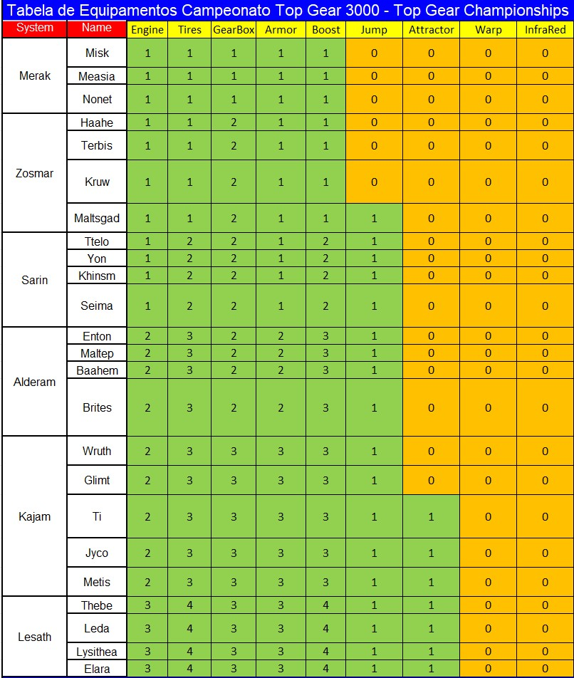
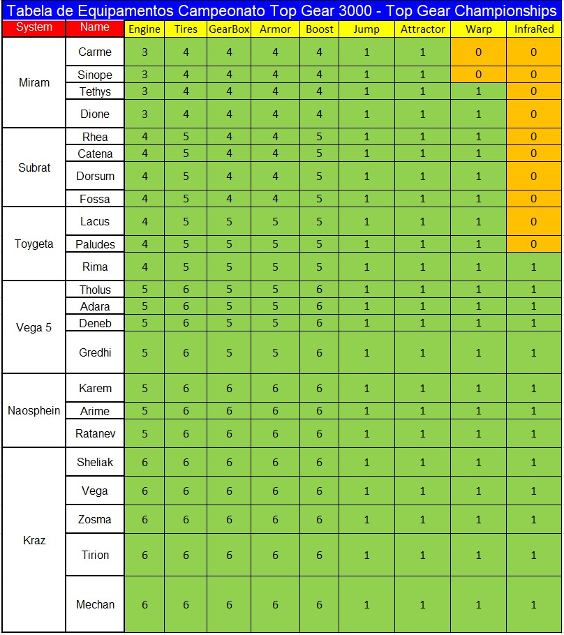

# **A Comunidade Top Gear Championships (TGC) Apresenta:** #

# **Campeonato Top Racer Collection 3024 - O Futuro é Agora!!!** #

# **LEIA TODAS AS REGRAS COM BASTANTE ATENÇÃO!!!** #

# **1. Incrições:** #

1.1 - O novo modelo de inscrições de campeonatos da TGC terá sempre uma pré-lista de inscritos já validados e ativos conforme os participantes dos campeonatos recentes. Conforme Lista a seguir:

  - 01 - Alisson Paulo (Jack Maloi)
  - 02 - Roberto Vasquez (The Mister)
  - 03 - Marlon Reis (Lonsoldier)
  - 04 - Edwin Huaylla (Ediwn HD)
  - 05 - Leonardo Andrade (LeomarxGames)
  - 06 - Jurandir Filho (Sr Filho)
  - 07 - Rafael Lopes (Diablo)
  - 08 - Robson Meireles (Rob Jax)
  - 09 - Ari Jr (Arijunino)
  - 10 - Jhonny (Jhonny)
  - 11 - Edson Silva (Senninkage)
  - 12 - Fabrício Canisso (Rannid)
  - 13 - Luís Cardenas (Luís L.A.O.M)
  - 14 - RonalDan (RonalDan)
  - 15 - Allan Live (Allan Live)
  - 16 - Javier Portillo (Javier)
  - 17 - Paulo Muniz (Paulo Fox)
  - 18 - Marcel Santana (MMM)
  - 19 - Petter Bruno (JackPoker40)
  - 20 - Luciano Alves (Luciano)

1.2 - Novos participantes poderão se inscrever através de postagem realizada diretamente nos comentários do post correspondente no Facebook.

    Exemplo:
    Apelido/Nickname: LeomarxGames
    Disponibilidade para jogar: Descrever o melhor possível. Ex.: Disponibilidade das 19 as 23h30 durante a semana e finais de semana a combinar com antecedência.
    Método que utiliza para conectar: Preferencialmente Radmin, se houver erro, poderá ser utilizado o Hamachi.

1.3. Logo de seguida deverá ingressar no grupo de WhatsApp do Campeonato pelo Link a ser divulgado e se apresentar com o seu Nome Real + Apelido/NickName

# **2. Validação e Verificação de Perfil dos Inscritos:** #

2.1.	A administração da TGC, na intenção de criar um campeonato com credibilidade, se reserva no direito de solicitar a qualquer momento durante a inscrição e/ou durante o campeonato, informações adicionais a qualquer um dos inscritos em seus campeonatos.

2.2.	Tais medidas, vem com o intuito de impedir a inscrição ou participação de jogadores com contas fakes.

2.3.	As informações solicitadas servem para um processo de verificação/confirmação de identidade, tais como:

- Perfil de rede social com foto (Facebook/Instagram/WhatsApp/Discord/Telegram/Twitter/TikTok/Outras).
- Vídeo chamadas por qualquer uma das redes sociais mencionadas que o participante tenha conta.
- Detalhes técnicos e verificação do processo de conexão online (Hamachi/Radmin), compartilhando a tela. (TeamViewer/AnyDesk/Outros)
- Tipo de computador, fotos do modem, Empresa de internet, IP virtual, IP do roteador, VPN, etc.

2.4.	O jogador inscrito tem o **direito de não fornecer as informações solicitadas**, assim como a TGC, também se reservam ao **direito de cancelar a inscrição ou remover um participante durante um campeonato**, que não concorde em providenciar as informações que lhe forem solicitadas.

# **3. Itens Obrigatórios:** #

3.1.  **Emulador Top Racer Collection (Steam) =** Link para compra/download [aqui](https://store.steampowered.com/app/2214000/Top_Racer_Collection/)

- Demais plataformas, como (Playstation/Xbox) não serão utilizadas porque no momento o jogo não possui rede para Crossplay Network.

3.2.	**Adesão às redes sociais da comunidade Top Gear Championships** 

### **[Facebook](https://www.facebook.com/groups/topgearchampionships)** ###
### **[Youtube](https://www.youtube.com/@topgearchampionships)** ###
### **[TikTok](https://www.tiktok.com/@topgearchampionships)** ###
### **[Instagram](https://www.instagram.com/topgearchampionships)** ###

# **4. Cronograma (Previsão):** #

4.1. As inscrições serão aceitas até às 21h do dia 02/08/2024;

4.2. Após confirmação das inscrições, será realizado o sorteio dos planetas e a Fase de Grupos até o dia 03/08/2024;

4.3. A depender da quantidade de inscritos a duração da fase de grupos terá de 7 a 14 dias.

4.4. Cada rodada da fase de grupos e da fase mata-mata (Oitavas, Quartas, Semifinal e Final/Disputa de 3º) terão o prazo de 5 dias, finalizando até às 23h59 do último dia de prazo (Horário de Brasília).

4.5. **Observação:** As rodadas podem ter o prazo estendido ou reduzido, caso a administração julgue necessário.

# **5. Organização e Chaveamento:** #

5.1. Será utilizado o CHALLONGE para chaveamento das partidas do campeonato [https://challonge.com/pt_BR/tgc3024](https://challonge.com/pt_BR/tgc3024)  

5.2. O campeonato será no modelo Copa do Mundo, com uma fase de grupos e os melhores colocados avançam para as próximas fases em disputas de jogo único.

5.3. Na fase de grupos, os jogadores pontuarão de acordo com seu resultado em cada partida, conforme a relação a seguir:

- Vitória = 3 pontos;
- Empate = 1 ponto;
- Derrota = 0 pontos.

5.3.1. A classificação se dará pelo maior número de pontos. Em caso de empate os critérios de desempate serão:

- Confronto direto;
- Pontos conquistados;
- Saldo de pontos
- Sorteio;

5.5. Não há limite para a quantidade de participantes e serão classificados para a fase final a quantidade de jogadores a seguir, dependendo da quantidade de inscritos:

- Inscritos: até 08. Classificados: 6;
- Inscritos: entre 09 e 12. Classificados: 8;
- Inscritos: entre 13 e 16. Classificados: 10;
- Inscritos: entre 17 e 20. Classificados: 12;
- Inscritos: entre 21 e 24. Classificados: 16;
- Inscritos: entre 25 e 28. Classificados: 20;
- Inscritos: entre 29 e 32. Classificados: 24;

5.6. Serão sorteados 2 sistemas solares com 4 planetas cada para a fase de grupos e cada um dos sistemas solares é uma partida. Observando:

- Para sistemas solares com 3 planetas, o último planeta deverá ser jogado 2x.
- Para sistemas solares com + de 4 planetas, deverão ser jogados os 4 primeiros e/ou sorteados.

5.7. Nas fases mata-mata, serão sorteados 3 sistemas solares para a oitavas, quartas e semifinal e um sistema solar para o desempate.

5.8. Na final e disputa de 3º, serão sorteados 4 sistemas solares para a disputa normal e um sistema solar para o desempate.

5.9. Em caso de empate nas fases finais, reinicia-se o jogo e joga-se a partir do sistema solar sorteado para o desempate:

- No desempate os pilotos devem utilizar normalmente os upgrades.
- Vencerá aquele que ao final do sistema solar sorteado tiver mais pontos que o oponente;
- Permanecendo o empate no primeiro, reinicia-se o jogo e joga-se o sistema solar seguinte ao anterior e assim sucessivamente, até haver um vencedor;
    Se durante o desempate houver Race Over para ambos, vencerá o piloto que tiver mais pontos até pista do race over.
    Se ocorrer race over logo na primeira pista, vencerá aquele que estiver na frente, em qualquer posição, antes da tela apagar.
    Obs.: Em comum acordo, os jogadores podem trocar de controle quanto forem iniciar o desempate para corrigir o grid de largada corretamente. Caso não haja consenso, será o player 1, aquele que tiver terminado na frente na última pista anterior ao início do desempate.

5.10. A substituição de jogadores só será adimitida, caso o piloto substituto ainda possa participar da partida referente à 2ª rodada. Caso um piloto desista do campeonato após a 1ª rodada, sua pontuação será atribuída ao seu substituto. Se não houver substituto, será aplicado w.o. para as partidas restantes, com pontuação máxima para o adversário e mínima para o desistente.

5.11. Após de 50% da partida realizada, um dos pilotos pode avisar ao oponente que deseja parar e admitir a derrota. Assim, o adversário leva os 5 pontos de cada pista restante e o desistente fica com zero pontos nas mesmas. Para este caso, a partida não será considerada w.o e não haverá sansões.

5.12. A tolerância de W.O's neste campeonato será no total de 2 partidas na fase de grupos se houver 3 ou mais partidas o piloto será impedido de participar do próximo campeonato da TGC. Até o final do prazo da fase de grupos, será oportunizado ao piloto que apresente justificativas, caso as justificativas sejam aceitas, o W.O. não será contabilizado para efeitos de punição.

# **6. Validação das partidas** #

*6.1. É obrigatório gravar ou transmitir ao vivo as partidas, seja pelo OBS Studio ou Steam ou outra forma.*

6.2. Ambos os jogadores são responsáveis pela gravação. Sugere-se que se um for fazer a transmissão que o outro grave para em caso de travamento da live a partida seja validada. 

6.3. Os jogadores que não gravarem ou transmitirem suas partidas, **terão seus confrontos invalidados** e não poderão abrir PROTOCOLO de possíveis irregularidades cometidas pelo adversário.

6.4. A resolução ideal é em HD 1280x720 (720p), porém para aqueles que não tenham um computador que consiga nesta gravar ou transmitir nessa resolução, a resolução mínima aceita será (SD) 854 x 480 (480p).

6.5. O arquivo de gravação pode ser disponibilizado na nuvem e o link divulgado no grupo do WhatsApp junto com o resultado, ou também pode ser feito o envio de arquivo de gravação diretamente no WhatsApp.

6.6. Não serão aceitos resultados enviados sem o cumprimento das regras de gravação mencionadas, sendo que uma nova partida deve ser realizada ou a renúncia de derrota por W.O. por um dos participantes.

# **7. Comunicação:** #

7.1. Serão criados grupos no WhatsApp para cada um dos grupos sorteados, sendo este o canal oficial para as marcações das partidas e divulgação de resultados. 

7.2. A permanência no grupo é obrigatória e o jogador que não participar estará eliminado do campeonato. O grupo deve ser usado para os anúncios da administração, agendamento de partidas e assuntos relevantes ao campeonato, tais como informações de problemas com conexão, remarcação de partidas, encaminhamentos de links das lives e postagem de resultados.

7.3. Os jogadores podem mencionar seu oponente, marcando com @, para agendamento de sua partida. Essa menção poderá ser realizada quantas vezes o jogador quiser, mas para efeitos de regras de verificação para W.O., só será considerada uma menção a cada 24 horas. Após a terceira menção do oponente (72h), sem a devida resposta, o jogador poderá reivindicar o W.O à administração.

7.4. Os participantes que não realizarem suas partidas ou agendamento delas nos prazos estabelecidos, através do grupo oficial do campeonato, receberão W.O., 

7.5. O W.O. será atribuído a favor daquele que oferecer maior tempo de disponibilidade, ou contra aquele que não comparecer no horário previamente agendado.

7.6. Em casos onde houver incompatibilidade total de horários entre os participantes, na análise de W.O., será priorizado aquele que esteve mais tempo disponível após às 18h ou finais de semana.

7.7. O envio de mensagens no chat do emulador estará proibido caso um dos participantes solicite no início da partida.

7.8. Os resultados das partidas devem ser informados no grupo respectivo do WhatsApp que o jogador for adicionado.

Exemplo de postagem de resultado:

- **Grupo A - Rodada 4**
- **@Player1 110 x 100 @Player2**
- **Link da live ou link do arquivo da gravação.**

7.9. O jogador que enviar mensagens sem relevância para grupo WhatsApp do campeonato, serão advertidos pela administração. Em caso de reincidência, o jogador será REMOVIDO do grupo por 12h e adicionado novamente após esse prazo. Mesmo com a punição, o jogador tem o dever de cumprir os seus jogos previamente agendados. O jogador readmitido no grupo será eliminado do campeonato caso receba mais uma punição por descumprimento do grupo de WhatsApp.

# **8. Regras de Conduta** #

8.1. É passível de eliminação do campeonato, mensagens ofensivas que se enquadrem em pelo menos um dos tipos de discriminação abaixo, dirigidos ao jogador ou à sua família:

- Racial ou étnica;
- Gênero ou Religião;
- Status social;
- De idade;
- Deficiência;
- Difamação ou calúnia;
- Nacionalidade, Naturalidade, ou Lugar onde mora, ou nasceu.

8.2. OBSERVAÇÕES: Mensagens trocadas em redes sociais particulares não serão consideradas. Denúncias e reclamações por ofensas somente serão consideradas e julgadas pela administração, se ocorrerem nos CANAIS OFICIAIS DA TGC (Facebook, WhatsApp, Discord, YouTube, Twitch, Instagram e outros) ou no chat da transmissão oficial de uma partida válida do campeonato. Chats privados (PV) e quaisquer outros meios não serão considerados. Caracterizada a ofensa desrespeitosa com a dignidade da pessoa, a administração se reserva exclusivamente à punição de exclusão do campeonato.

8.3. Outras medidas referentes a processos legais, deverão ser adotadas pelo próprio requerente. 

8.4. Para protocolar a reclamação, os print’s das mensagens ou áudios (enviados no período de realização do campeonato, nas redes oficiais da TGC), devem ser encaminhados através de protocolo conforme modelo no item a seguir, pelo Facebook, no post de inscrição do campeonato com a hashtag #PROTOCOLO e deverá ser respondido pela administração em um prazo máximo de 48h úteis.

8.5. **Modelo de protocolo:** 

    PROTOCOLO DE JULGAMENTO DE CONDUTA NOME DO CAMPEONATO:
    - NOME DO CAMPEONATO:
    - NOME DO SOLICITANTE:
    - NOME DO OPONENTE:
    *SOLICITAÇÃO: Solicito que os administradores da TGC julguem se a conduta a seguir é caracterizada como discriminação conforme previsto no item de Regras de Conduta e seus subitens.*
    *ACUSAÇÃO: descrever a alegação de forma sucinta.*
    *ANEXOS: encaminhar as imagens, vídeos e áudios que julgar relevante no tópico aberto ou no privado dos administradores*

# **9. Regras Gerais:** #

9.1. Proibido o uso do freio para prejudicar o adversário de maneira proposital e desleal;

9.2. Proibido o uso do freio ou desaceleração total para parar carro na pista antes do combustível acabar;

9.3. Caso o jogador perca por w.o. e não apresente justificativas (regra 5.12), este será impedido de participar dos dois próximos campeonatos realizados pela Comunidade TGC (TG1, TG2 ou TG3000);

9.4. As justificativas apresentadas conforme o item 9.3, serão analisadas pela ADM da TGC para decisão da punição.

# **10. Regras Específicas:** #

### **Procedimentos para início da partida** ###

10.1 - Para jogar o campeonato, basta agendar com o seu oponente pelo grupo de WhatsApp que será criado o melhor horário para ambos.

10.2 - Entrarem no jogo Top Racer Collection (TRC) pela Steam e um piloto cria a sala da disputa e o outro entra na partida criada.

10.3 - Para Criar a partida, no menu principal seguir:
  - Modo Online
  - Tipo de Sala = Pública
  - Escolher o Jogo Top Racer 3000
  - Modo de Jogo = Copa Personalizada
  - Velocímetro = KPH
  - Dificuldade = **Campeão**

10.4 - Criar/Editar a Copa Personalizada com os 4 planetas sorteados.

10.5 - Pré-configurar o carro conforme a orientação abaixo.

**Tabela de Equipamentos Campeonato Top Gear 3000 - Top Gear Championships - parte 1**

**Tabela de Equipamentos Campeonato Top Gear 3000 - Top Gear Championships - parte 2**

### **Sugere-se ja baixar as imagens ou guardar esse link para facilitar a configuração dos carros.** ###

10.6 - Pontuação a cada pista:

- 1st = 10 pontos
- 2nd = 8 pontos
- 3rd = 6 pontos
- 4th = 5 pontos
- 5th = 4 pontos
- 6th = 3 pontos
- 7th = 2 pontos
- 8th = 1 pontos

10.7 - O resultado da partida será a soma dos pontos obtidos pelos jogadores em cada planeta disputado;

# **11. Situações inéditas** #

11.1. Situações inéditas podem ocorrer e os casos não previstos aqui serão analisados pela administração no decorrer do campeonato.**

11.2. **As regras podem ser aditadas durante o campeonato, caso a administração julgue necessário para cobrir casos que não forem cobertos por essas regras buscando não prejudicar os participantes.**

# **A administração da TGC desejam à todos um excelente campeonato e principalmente muita diversão a todos os participantes e expectadores!!!** #

