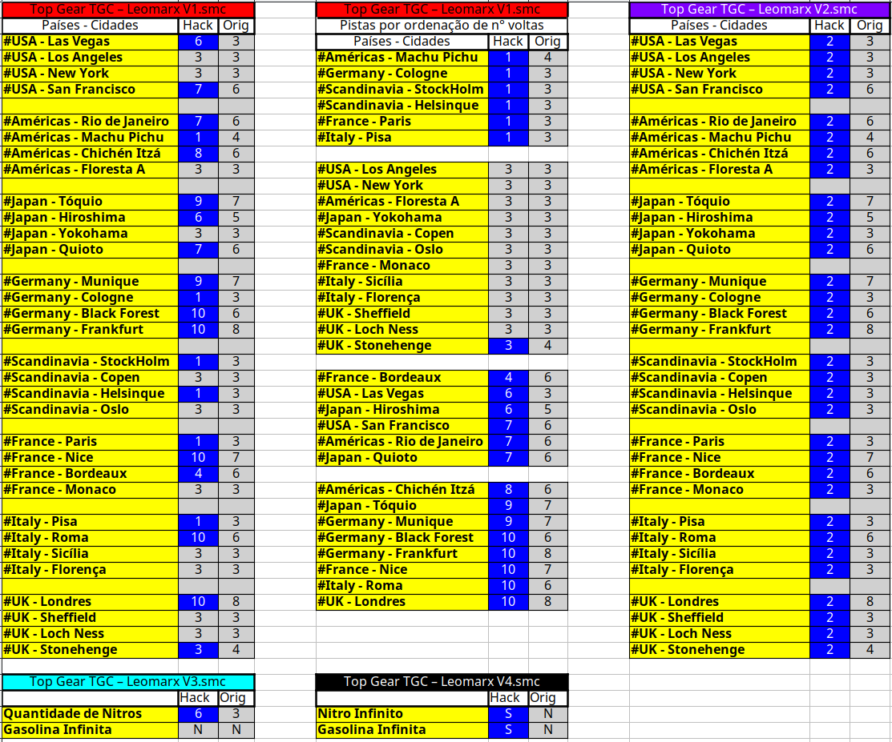

# **A Comunidade Top Gear Championships (TGC) Apresenta:** #

# **Campeonato Top Gear TGC Cenários 4.0 - WhatIf 2024** #

# **LEIA TODAS AS REGRAS COM BASTANTE ATENÇÃO!!!** #

# **1. Inscrições:** #

1.1 - Lista dos participantes com os respectivos Apelidos e/ou nomes do Facebook.

1.2 - As inscrições para o torneio podem ser encerradas antecipadamente, caso seja atingido o número par de participantes para que o chaveamento seja feito de forma correta com um número par de jogadores 8/10/12/14... 16.

1.3 - Poderá ser feito cadastro reserva de jogadores a fim de preencher possíveis desistência de jogadores.

1.4 - CONFIRME SUA INSCRIÇÃO UTILIZANDO O MODELO ABAIXO:

    Apelido/Nickname: LeomarxGames
    Número de telefone com WhatsApp: +55 11 99999-8888
    Disponibilidade para jogar: à noite durante a semana e finais de semana a combinar com antecedência.
    Método que utiliza para conectar: Preferencialmente Radmin, se houver erro, poderá ser utilizado o Hamachi.
    Declaração: Declaro que estou ciente das regras aqui estabelecidas e serei automaticamente desclassificado em caso de descumprimento: ( X ) SIM ( ) NÃO. A inscrição só será efetivada caso o participante marque a opção SIM.

1.5 - A TGC se reserva ao direito do uso de imagem dos participantes inscritos neste torneio, seja para retransmissões de partidas realizadas, bem como na divulgação de vídeos promocionais em suas redes sociais.

1.6 - Todos os participantes ao se inscreverem no campeonato, declaram estar cientes de todas as regras aqui estabelecidas e poderão sofrer as punições previstas, desde um w.o, uma possível eliminação do campeonato ou até exlusão da Comunidade.

# **2. Cronograma (Previsão):**

2.1 - Prazo para confirmações do participantes anteriores e novas inscrições: 07/03/2023 às 17h59

2.2 - Após revisão das inscrições será feito o sorteio das pistas/países e inicia-se a Fase de Grupos

2.3 - Fase de grupos terá prazo de 17 dias. Previsão de término – 24/03/2023 23h

2.4 - Oitavas de final terá prazo de 6 dias: Previsão de término – 31/03/2023 23h

2.5 - Quartas de final terá prazo de 6 dias: Previsão de término – 07/04/2023 23h

2.6 - Semifinal, Final e terceiro terá prazo de 6 dias: Previsão de término – 14/04/2023 23h

**Observação:** As rodadas podem ter um prazo estendido caso a administração julgue necessário. *Queremos ver quem é o melhor na pista e não um show de regras com W.O's*

# **3. Organização e Chaveamento:**

3.1 - Será utilizado o CHALLONGE para chaveamento das partidas do campeonato.

3.2 - Modelo a ser definido após a confirmação da quantidade de inscritos (Provável modelo padrão de copa ou Suíço com 10 a 12 fases )

3.3 - O nível do jogo será o CHAMPIONSHIP.

3.4 - Fase de grupos: Todos os cenários pelo menos 1x

3.5 - Oitavas e Quartas de Final: 3 cenários, vence aquele que tiver a maior soma de pontos no final de todos os cenários

3.6 - Semifinal: 4 cenários (2 ida e 2 volta), vence aquele que tiver a maior soma de pontos no final de todos os cenários

3.7 - Final e terceiro: 5 cenários, vence aquele que tiver a maior soma de pontos no final de todos os cenários

**Observação:** Alguns cenários terão o seu carro previamente sorteado

# **4. Cenários e ROMs Hack:**

Para jogar o campeonato todos os pilotos devem baixar e configurar as 4 ROMs criadas e modificadas. Os links para baixar são:

- Hack1 (https://topgearchampionships.com/tg1/Top%20Gear%20TGC%20Hack1%20-%20LeomarxGames.smc)
- Hack2 (https://topgearchampionships.com/tg1/Top%20Gear%20TGC%20Hack2%20-%20LeomarxGames.smc)
- Hack3 (https://topgearchampionships.com/tg1/Top%20Gear%20TGC%20Hack3%20-%20LeomarxGames.smc)
- Hack4 (https://topgearchampionships.com/tg1/Top%20Gear%20TGC%20Hack4%20-%20LeomarxGames.smc)

## **5. Cenário 1 - Novas Estratégias:**
**ROM Hack1 Requerida**

E se tivesse mais voltas do que o normal em algumas pistas? 

Modificação: Algumas pistas do jogo agora tem um número maior de voltas, outras pistas tem um número reduzido.

Objetivo: Jogar normalmente as pistas sorteadas e tentar o seu melhor com o novo número de voltas. Tabela abaixo serve de guia.

## **5. Cenário 2 - Reis da Arrancada:**
**ROM Hack2 Requerida**

Copiando o estilo arrancada do need for speed essa é para aqueles que gostam de decidir tudo logo de cara. Um erro de largada pode ser fatal.

Modificação: Todas as pistas do jogo estão com 3 Nitros e 2 Voltas! (Que tal um full game?)

Objetivo: Fazer aquelas largadas perfeitas e mandar seu oponente comer poeira. Tabela abaixo serve de guia.

## **5. Cenário 3 - Promoção Tanque Cheio Grátis:**
**ROM Hack3 Requerida**

Objetivo: **Pilotos devem obrigatoriamente entrar nos boxes em todas as voltas** e abastecer o quanto quiser e achar necessário, o combustível é **grátis**

Atenção: **Se errar a entrada do Pit stop é como se desse pane seca!!!** 
O jogador que errar deve imediatamente parar de acelerar e poderá apenas posicionar o seu carro na pista para tentar ganhar empurrões de bots ou desistir até a próxima pista.
Se ambos errarem durante uma partida e ninguém se recuperar com empurrões, os pilotos deverão aguardar o jogo dar race over e então jogar normalmente a próxima pista.

Modificação: Toma aí 6 nitros para tentar recuperar as posições que serão perdidas.

Objetivo: Jogar normalmente as pistas sorteadas e ver se o atraso do pit stop impedirá de chegar em 1st e 2nd.

## **5. Cenário 4 - Velozes e Furiosos 2092:**
**ROM Hack4 Requerida**

E se tivesse Nitros e Gasolina Infinita? Seu desejo virou uma ordem!!! Corridas eletrizantes e adrenalina a mil com super velocidades acima de 300km/h.

Bata todos os records de tempo do Guinness Book se os bots deixarem é claro. Quero ver tangências de curvas sem tirar o pé do acelerador hahaha! 

Sua chance de dar uma ou duas voltas em cima do Ritchie.

Modificações: Nitros e Gasolina Infinita.

Objetivo: Jogar normalmente as pistas sorteadas e Objetivo: Jogar normalmente as pistas sorteadas e emendando um nitro atrás do outro.

## **5. Cenário 5 - Efeito Borboleta:**
**ROM Hack1 Requerida**

"Dormammu, Eu vim Barganhar", "Dormammu, Eu vim Barganhar". Entrou no loop temporal do Dr. Estranho?

Modificação: Algumas pistas do jogo agora tem um número maior de voltas, outras pistas tem um número reduzido.

Objetivo: Jogar a pista sorteada por diversas vezes repetidamente.

**Detalhes:**
- Terá um sorteio de 2 a 16 que representará a quantidade de vezes que uma pista deverá ser jogada
- Quanto maior o número de repetição, pistas mais simples e com menos voltas serão atribuídas.

**Exemplo:**
- Se cair repetição de 2 a 3x. Serão sorteadas pistas com 8, 9 ou 10 voltas
- - Exemplo Pior cenário 3x Roma com 10 voltas
- Se cair repetição de 4 a 6x. Serão sorteadas pistas com 4, 5, 6 ou 7 voltas
- - Exemplo Pior cenário 6x Rio com 7 voltas
- Se cair repetição de 7 a 10x. Serão sorteadas pistas com 3 voltas
- - Exemplo Pior cenário 10x Stonehenge com 3 voltas
- Se cair repetição de 11 a 13x. Serão sorteadas pistas com 2 voltas
- - Exemplo Pior cenário 13x Pisa com 2 voltas
- Se cair repetição de 14 a 16x. Serão sorteadas pistas com 1 volta apenas.
- - Exemplo Pior cenário 16x Colônia com 1 volta

Apesar de parecer um alto volume... As partidas não irão passar de mais 30 minutos de jogo, porque colônia com uma volta só é 40 segundos cada vez que jogar hahaha!

# **6. Classificação Desempate:**

6.1 - A classificação da fase de grupos se dará pela Pontuação Geral.

6.2 - Na fase de grupos o desempate se aplicará apenas na Pontuação geral, seguindo as regras:

- Pontuação Geral, Confronto Direto, Jogos Vencidos, Pontos Conquistados.

6.3 - Nas fases finais o desempate será a soma dos cenários jogados, conforme o exemplo abaixo:
        
- 1º Cenário 100 x 80
- 2º Cenário 80 x 110
- Total 180 x 190

6.4 - Para desempate na fase final será jogando o cenário de Full Game de 2 voltas, iniciando do país sorteado:
    - Após 4 corridas mínimas, vence o desempate, o jogador que abrir mais de 5 (cinco) pontos em qualquer momento da disputa.
    - Permanecendo o empate, o cenário deverá ser jogado sucessivamente, até que um jogador abra mais de 5 pontos de vantagem.

# **7. Comunicação:** #

  7.1 - Serão criados grupos no WhatsApp para cada uma das Séries, sendo este o canal oficial para as marcações das partidas e divulgação de resultados. A permanência no grupo é obrigatória e o jogador que não participar estará eliminado do campeonato.

  7.2 - O grupo deve ser usado para os anúncios da administração, agendamento de partidas e assuntos relevantes ao campeonato, tais como informações de problemas com conexão, remarcação de partidas, encaminhamentos de links das lives e postagem de resultados.

  7.3 - Os jogadores podem mencionar seu oponente, marcando com @, para agendamento de sua partida. Essa menção deverá acontecer no máximo a cada 24horas. Após a terceira menção do oponente (72h), sem a devida resposta, o jogador poderá reivindicar o W.O à administração.

  7.4 - Os jogadores devem anunciar o resultado de suas partidas no grupo.

  7.5 - O envio de mensagens no chat do emulador estará proibido caso um dos participantes solicite no início da partida.

  7.6 - A gravação da partida é opcional, porém caso haja discordância do resultado postado sem uma gravação o resultado postado de comum acordo entre os pilotos será o válido.

  7.7 - Mensagens sem Relevância:

  - 7.7.1 - O jogador que enviar mensagens no grupo, sem relevância para o campeonato, serão advertidos pela administração. Em caso de reincidência, o jogador será REMOVIDO do grupo.

  - 7.7.2 - Mesmo com a punição o jogador tem o dever de cumprir os seus jogos previamente agendados.

  - 7.7.3 - Após 12h, o jogador removido poderá solicitar aos admins entrar novamente ao grupo.

  - 7.7.4 - O jogador readmitido no grupo que após a segunda advertência, tiver que receber a segunda punição, estará eliminado do campeonato.

# **8. Regras de Conduta** #

8.1. É passível de eliminação do campeonato, mensagens ofensivas que se enquadrem em pelo menos um dos tipos de discriminação abaixo, dirigidos ao jogador ou à sua família:

- Racial ou étnica;
- Gênero ou Religião;
- Status social;
- De idade;
- Deficiência;
- Difamação ou calúnia;
- Nacionalidade, Naturalidade, ou Lugar onde mora, ou nasceu.

8.2. OBSERVAÇÕES: Mensagens trocadas em redes sociais particulares não serão consideradas. Denúncias e reclamações por ofensas somente serão consideradas e julgadas pela administração, se ocorrerem nos CANAIS OFICIAIS DA TGC (Facebook, WhatsApp, Discord, YouTube, Twitch, Instagram e outros) ou no chat da transmissão oficial de uma partida válida do campeonato. Chats privados (PV) e quaisquer outros meios não serão considerados. Caracterizada a ofensa desrespeitosa com a dignidade da pessoa, a administração se reserva exclusivamente à punição de exclusão do campeonato.

8.3. Outras medidas referentes a processos legais, deverão ser adotadas pelo próprio requerente. 

8.4. Para protocolar a reclamação, os print’s das mensagens ou áudios (enviados no período de realização do campeonato, nas redes oficiais da TGC), devem ser encaminhados através de protocolo conforme modelo no item a seguir, pelo Facebook, no post de inscrição do campeonato com a hashtag #PROTOCOLO e deverá ser respondido pela administração em um prazo máximo de 48h úteis.

8.5. **Modelo de protocolo:** 

    PROTOCOLO DE JULGAMENTO DE CONDUTA NOME DO CAMPEONATO:
    - NOME DO CAMPEONATO:
    - NOME DO SOLICITANTE:
    - NOME DO OPONENTE:
    *SOLICITAÇÃO: Solicito que os administradores da TGC julguem se a conduta a seguir é caracterizada como discriminação conforme previsto no item de Regras de Conduto e seus subitens.*
    *ACUSAÇÃO: descrever a alegação de forma sucinta.*
    *ANEXOS: encaminhar as imagens, vídeos e áudios que julgar relevante no tópico aberto ou no privado dos administradores*

# **9. Regras Gerais:** #

9.1. Clique aqui para ler a base das Regras Gerais link  (https://www.facebook.com/groups/topgearchampionships/permalink/3391700757764527);

9.2. Proibido o bug de bater no poste para ganhar duas posições;

9.3. Proibido o uso do freio em curvas para derrapagem, devido ao bug de não reduzir a velocidade, ser exclusiva para o P1;

9.4. Proibido o uso do freio para prejudicar o adversário de maneira proposital e desleal;

9.5. Proibido o uso do freio ou desaceleração total para parar carro na pista antes do combustível acabar;

9.6. Em caso de pane seca para ambos os jogadores em pistas como Roma, Rain Forest, Bourdeaux, Monaco, Pisa entre outras, será atribuída a pontuação da posição final dos jogadores ao se escurecer completamente a tela. Para jogar a próxima pista, os jogadores deverão voltar ao menu inicial e selecionar o restante das pistas (utilizando a ROM TGC) ou jogar o país completo novamente (utilizando a ROM Original).
- Obs.: Caso seja necessário jogar o país novamente, a contagem de pontos das pistas daquele país jogadas anteriormente será zerada.
- Obs.: Caso um dos jogadores informe que tem o save state do início da pista onde aconteceu a pane, estes deverão correr a pista novamente através do save.

9.7. Caso o país sorteado seja UK, na pista de STONEHENGE, as pontuações serão atribuídas de acordo com as posições finais dos jogadores imediatamente quando a tela escurecer após o Out Of Fuel;
- Obs.: se um dos jogadores completar STONEHENGE, aquele que não completar não receberá nenhuma pontuação atribuída.

9.8. Caso seja sorteado o país UK, este deverá ser corrido por último, mesmo utilizando a Rom TGC;

9.9. Caso alguma Regra Geral esteja divergente de alguma regra estabelecida aqui neste post, vale a regra deste documento para o campeonato.

# **10. Regras Específicas:** #

10.1. Será utilizado o emulador ZSNES 1.42;

10.2. A ROM deverá ser a Top Gear TGC (E) [!] ou Top Gear (E) [!];

10.3. Nível/Level: **Championship**;

10.4. A escolha de câmbio (automático ou manual) é livre durante todo o campeonato;

10.5. A conexão deverá ser estabelecida por rede VPN RADMIN ou HAMACHI;

10.6. Em comum acordo, os jogadores podem trocar de controle quanto forem iniciar o desempate e/ou jogo de volta para corrigir o grid de largada corretamente; 

10.7. Não havendo consenso na escolha de quem é o Player 1 ou o Player 2, o Player 1 será aquele que vier primeiro na tabela do Challonge;

10.8. O resultado da partida será a soma dos pontos obtidos pelos jogadores em cada país disputado;

10.9. Procedimento para início da partida:

- Selecione 2 Jogadores;
- Digitem seus nomes se desejado;
- Selecione o Cambio, Controle e Carro;
- Selecione a Dificuldade: Championships;
- Para selecionar as pistas na Rom Top Gear TGC Rom (E) [!], o jogador que estiver com o controle P1, deverá seguir o Manual de instruções da TGC ROM:
- Em Track, movendo para esquerda ou direita, selecione a pista (ela é apresentada pelo nome);
- Para selecionar a pista Pressione o botão "A". Ao selecionar uma pista, um contador de seleção aparecerá: "1, 2, 3... e assim por diante";
- Caso precise corrigir alguma seleção pressione o botão "B" para retirar a última pista selecionada;
- O Password para abrir todos os países na Rom Original é KELLSON. Ir para o menu COUNTRY, selecionar UK, usar o password, e depois selecionar o país;

# **11. Itens e Links Importantes** #

11.1.    **Emulador ZSNES 1.42 =** Link para download [aqui](https://www.zsnes.com/index.php?page=files)

11.2.	**ROM Top Gear TGC (E) [!].smc** = Link para download [aqui](https://www.facebook.com/groups/topgearchampionships/files/files)

11.3.	**Top Gear (E) [!].smc** = Link para download [aqui](https://www.facebook.com/groups/topgearchampionships/permalink/2435336390067640)

11.4.	**Radmin para conexão entre os jogadores** = Link para download [aqui](https://vpn.net/)

11.5. **Hamachi para conexão entre os jogadores** = Link para download [aqui](https://vpn.net/)

11.6 [ENVIO CARRO] = (https://www.topgearchampionships.com/comissario/comissario.html)
  
11.7 [LOGS COMISSARIO] = (https://www.topgearchampionships.com/comissario/logsPublicosComissario.html)

# **12. Validação e Verificação de Perfil dos Inscritos:** #

12.1. A administração da TGC, na intenção de criar um campeonato com credibilidade, se reserva no direito de solicitar a qualquer momento durante a inscrição e/ou durante o campeonato, informações adicionais a qualquer um dos inscritos em seus campeonatos.

12.2. Tais medidas, vem com o intuito de impedir a inscrição ou participação de jogadores com contas fakes.

12.3. As informações solicitadas servem para um processo de verificação/confirmação de identidade, tais como:

  - Perfil de rede social com foto (Facebook/Instagram/WhatsApp/Discord/Telegram/Twitter/TikTok/Outras).
  - Vídeo chamadas por qualquer uma das redes sociais mencionadas que o participante tenha conta.
  - Detalhes técnicos e verificação do processo de conexão online (Hamachi/Radmin), compartilhando a tela. (TeamViewer/AnyDesk/Outros)
  - Tipo de computador, fotos do modem, Empresa de internet, IP virtual, IP do roteador, VPN, etc.

12.4. O jogador inscrito tem o direito de não fornecer as informações solicitadas, assim como a TGC, também se reservam ao direito de cancelar a inscrição ou remover um participante durante um campeonato, que não concorde em providenciar as informações que lhe forem solicitadas.

# **13. Validação das partidas:** #

13.1. É obrigatório gravar ou transmitir ao vivo as partidas, seja pelo OBS Studio ou Emulador.

13.2. Ambos os jogadores são responsáveis pela gravação. Sugere-se que se um for fazer a transmissão que o outro grave para em caso de travamento da live a partida seja validada.

13.3. Os jogadores que não gravarem ou transmitirem suas partidas, terão seus confrontos invalidados e não poderão abrir PROTOCOLO de possíveis irregularidades cometidas pelo adversário.

13.4. A resolução ideal é em HD 1280x720 (720p), porém para aqueles que não tenham um computador que consiga nesta gravar ou transmitir nessa resolução, a resolução mínima aceita será (SD) 854 x 480 (480p).

13.5. O arquivo de gravação deve ser disponibilizado na nuvem e o link divulgado no grupo do WhatsApp, ou também pode ser feito o envio de arquivo de gravação diretamente no WhatsApp.

13.6. Não serão aceitos resultados enviados sem o cumprimento das regras de gravação mencionadas, sendo que uma nova partida deve ser realizada ou a renúncia de derrota por W.O. por um dos participantes.

# **14. Situações inéditas** #

14.1. Situações inéditas podem ocorrer e os casos não previstos aqui serão analisados pela administração no decorrer do campeonato.

14.2. **As regras podem ser aditadas durante o campeonato, caso a administração julgue necessário para cobrir casos que não forem cobertos por essas regras buscando não prejudicar os participantes.**

# **A administração da TGC desejam à todos um excelente campeonato e principalmente muita diversão a todos os participantes e expectadores!!!** #
